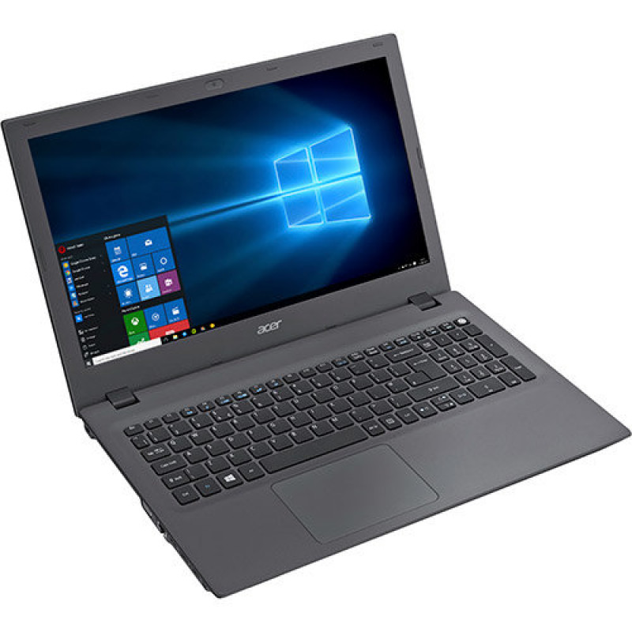

# EFI Acer E5 573G 74Q5 Catalina

#### Efi folder for the Acer E5 573G 74Q5 Laptop running MacOS Catalina 10.15 and Ubuntu 19.10 in Dual Boot

### Specs
- Intel Core i7 5500u
- 8GB ddr3 ram
- Nvidia GT 920m 2GB
- Im currently using two ssd's for MacOS and Ubuntu, so i recommend using it, mostly for MacOS.
- I also upgraded the stock screen, which is 1366x766, to a new 1920x1080, looks great on Mac.

### Things working
- Mac OS 10.15.2
- Bluetooth
- WiFi

### Things NOT working
- Some controls (like the fn + arrows for screen brightness)
- GPU on MacOS, but you can use it normally on Ubuntu and/or Windows (you should disable it in the first mac boot, in the advanced Bios: fn + tab 3 times, then reboot again in bios mode, and voìla. Remember to re-enable it if you want to use it in other systems)
- The dual core i7 processor looks like turned into a celeron, the performance is capped by half or more.
- Some minor things i dont remember now.
